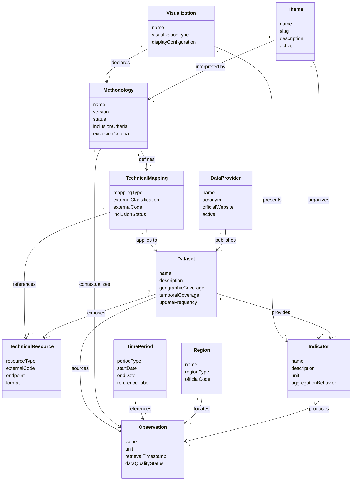

# Domain Model

**Version:** 0.1.0
**Status:** Initial proposal

---

# 1. Purpose

This document defines the initial domain model of the Public Data Atlas.

The model describes the main concepts of the platform, their responsibilities, and their relationships without depending on a specific programming language, database, framework, or infrastructure technology.

Its purpose is to establish a shared conceptual foundation for the backend, frontend, ETL processes, database design, API, and project documentation.

---

# 2. Domain Overview

The Public Data Atlas transforms official public data into accessible and traceable knowledge.

Users should not be required to understand government table numbers, variable identifiers, classification codes, or provider-specific APIs.

Instead, users interact with concepts such as:

* Themes
* Indicators
* Regions
* Time periods
* Methodologies

The platform translates these concepts into the technical structures required by each official data provider.

The central domain flow is:

```text
User
  |
  v
Theme
  |
  v
Indicator
  |
  v
Methodology
  |
  v
Technical Mapping
  |
  v
Dataset
  |
  v
Data Provider
  |
  v
Official Data
```

---

# 3. Domain Principles

## 3.1 User-Centered Language

The public interface must use concepts that are understandable to users.

Technical identifiers should remain internal to the platform whenever possible.

---

## 3.2 Provider Independence

Domain concepts must not depend directly on the terminology or structure of a specific data provider.

IBGE, DATASUS, the Central Bank of Brazil, and other providers may organize their data differently, but the platform should offer a consistent experience.

---

## 3.3 Methodological Traceability

Every transformation, grouping, or interpretation must be connected to a documented methodology.

It must be possible to identify:

* Which methodology was used.
* Which version was used.
* Who created or adopted it.
* Which references support it.
* Which technical codes were included or excluded.

---

## 3.4 Reproducibility

A result should be reproducible using:

* The same official dataset.
* The same dataset version or reference period.
* The same methodology version.
* The same technical mappings.
* The same transformation rules.

---

## 3.5 Separation of Concepts

Themes, datasets, methodologies, indicators, and visualizations represent different domain concepts and should not be treated as the same entity.

For example, a theme does not belong exclusively to a dataset or provider.

The theme `Healthcare` may contain indicators from CEMPRE, DATASUS, Census data, and other official datasets.

---

# 4. Core Domain Entities

## 4.1 Data Provider

A Data Provider represents an official institution responsible for publishing public data.

Examples include:

* IBGE
* Central Bank of Brazil
* DATASUS
* IPEA
* INMET
* TSE

### Main attributes

* Identifier
* Name
* Acronym
* Description
* Official website
* Access information
* Update policy
* Active status

### Responsibilities

* Identify the official origin of the data.
* Store provider-level metadata.
* Describe how the provider exposes its datasets.
* Maintain provenance information.

### Relationships

```text
Data Provider
      |
      | publishes
      v
   Dataset
```

A provider may publish multiple datasets.

A dataset belongs to one primary provider.

---

## 4.2 Dataset

A Dataset represents an official collection of related data published by a provider.

Examples include:

* CEMPRE
* Population Census
* National Health Information Systems
* National Consumer Price Index

A dataset is not the same as a technical table. It represents a meaningful official data collection that may contain multiple tables, variables, dimensions, and classifications.

### Main attributes

* Identifier
* Provider identifier
* Name
* Description
* Official reference
* Geographic coverage
* Temporal coverage
* Update frequency
* Access method
* License or usage conditions
* Active status

### Responsibilities

* Describe the official data collection.
* Maintain source and coverage metadata.
* Connect indicators to their original source.
* Define which technical resources can be queried.

### Relationships

```text
Data Provider
      |
      v
   Dataset
      |
      +------ provides ------> Indicator
      |
      +------ uses ----------> Technical Resource
```

---

## 4.3 Technical Resource

A Technical Resource represents a provider-specific structure used to retrieve data.

Depending on the provider, it may represent:

* A SIDRA table.
* An API endpoint.
* A downloadable file.
* A database view.
* A statistical table.
* A data service.

### Main attributes

* Identifier
* Dataset identifier
* Resource type
* External code
* Name
* Endpoint or source location
* Format
* Metadata
* Active status

### Responsibilities

* Store provider-specific access information.
* Connect the domain model to external data structures.
* Isolate technical provider details from user-facing concepts.

Technical Resources belong to the infrastructure boundary of the domain. Users should not normally interact with them directly.

---

## 4.4 Theme

A Theme represents a subject or area of interest through which users explore public data.

Initial examples include:

* Technology
* Industry
* Agriculture
* Commerce
* Healthcare
* Education

A theme is a semantic concept and does not belong exclusively to one dataset, methodology, or provider.

### Main attributes

* Identifier
* Name
* Slug
* Description
* Parent theme, when applicable
* Active status

### Responsibilities

* Organize indicators using understandable concepts.
* Provide a stable navigation structure.
* Group knowledge from different datasets.
* Hide provider-specific classifications from users.

### Relationships

```text
Theme
  |
  +------ contains ------> Indicator
  |
  +------ interpreted through ------> Methodology
```

A theme may contain multiple indicators.

An indicator may be associated with one or more themes.

A theme may have multiple valid methodologies.

---

## 4.5 Indicator

An Indicator represents a measurable concept presented to users.

Examples include:

* Number of companies
* Number of local units
* Total employed personnel
* Average monthly salary
* Total payroll
* Population
* Number of hospital admissions

An indicator describes what is being measured, not necessarily how a specific provider stores the value.

### Main attributes

* Identifier
* Name
* Slug
* Description
* Unit of measurement
* Calculation type
* Aggregation behavior
* Dataset identifier
* Source variable reference
* Active status

### Responsibilities

* Represent a meaningful measurable concept.
* Connect user-facing metrics to official data.
* Define units and aggregation rules.
* Preserve traceability to the source.

### Relationships

```text
Theme
  |
  v
Indicator
  |
  +------ sourced from ------> Dataset
  |
  +------ interpreted by ---> Methodology
  |
  +------ produces ---------> Observation
```

An indicator may be available in multiple themes.

A dataset may provide multiple indicators.

---

## 4.6 Methodology

A Methodology defines how official data is selected, grouped, transformed, interpreted, or presented.

Examples include:

* A definition of the technology sector based on selected CNAE codes.
* An OECD classification adopted for a Brazilian dataset.
* A university research methodology for grouping economic activities.
* A transformation used to calculate an derived indicator.

### Main attributes

* Identifier
* Name
* Version
* Description
* Author
* Institution
* Publication date
* Status
* Inclusion criteria
* Exclusion criteria
* References
* Change notes

### Responsibilities

* Document the scientific reasoning behind transformations.
* Define inclusion and exclusion criteria.
* Version methodological decisions.
* Preserve historical reproducibility.
* Support alternative interpretations of the same theme.

### Methodology status

A methodology may have one of the following states:

* Draft
* Under review
* Approved
* Deprecated
* Archived

### Versioning

Methodologies must be versioned.

A change that alters the resulting data grouping must create a new methodology version rather than silently modifying an existing version.

Example:

```text
Technology Sector Methodology
  |
  +-- Version 1.0
  |
  +-- Version 1.1
  |
  +-- Version 2.0
```

Previously generated results must continue to reference the methodology version originally used.

---

## 4.7 Technical Mapping

A Technical Mapping connects a methodology or domain concept to provider-specific technical codes.

Examples include:

* Connecting the `Technology` theme to a set of CNAE codes.
* Connecting an indicator to a SIDRA variable identifier.
* Connecting a region to an official geographic code.
* Connecting a methodology to selected categories in a dataset.

### Main attributes

* Identifier
* Methodology version identifier
* Dataset identifier
* Technical resource identifier
* Mapping type
* External classification
* External code
* Included or excluded status
* Description
* Validity period

### Responsibilities

* Translate semantic concepts into technical codes.
* Document which categories are included or excluded.
* Preserve traceability between platform concepts and official classifications.
* Allow mappings to evolve through methodology versioning.

### Example

```text
Theme: Technology
        |
        v
Methodology: Technology Sector Classification v1.0
        |
        v
Technical Mappings
        |
        +-- CNAE 62.01-5
        +-- CNAE 62.02-3
        +-- CNAE 62.03-1
        +-- CNAE 63.11-9
```

The theme remains stable while the methodology and its mappings may evolve.

---

## 4.8 Region

A Region represents a geographic area used to filter or aggregate observations.

Examples include:

* Brazil
* Geographic region
* State
* Municipality
* Health region
* Administrative region

### Main attributes

* Identifier
* Name
* Region type
* Parent region
* Official geographic code
* Provider-specific mappings
* Validity period

### Responsibilities

* Represent geographic hierarchies.
* Support geographic filtering and aggregation.
* Connect internal geographic concepts to official codes.

### Geographic hierarchy example

```text
Brazil
  |
  v
South Region
  |
  v
Santa Catarina
  |
  v
Chapecó
```

A region may have different technical codes across providers. These differences should be handled by mappings rather than exposed to users.

---

## 4.9 Time Period

A Time Period represents the temporal reference of an observation.

Examples include:

* Year
* Quarter
* Month
* Specific reference date
* Multi-year period

### Main attributes

* Identifier
* Period type
* Start date
* End date
* Reference label
* Provider-specific reference

### Responsibilities

* Standardize temporal references.
* Support time-series analysis.
* Preserve the original reference period of official data.
* Allow comparisons across datasets when methodologically valid.

---

## 4.10 Observation

An Observation represents a measurable value retrieved or calculated for a specific combination of domain dimensions.

An observation normally connects:

* An indicator.
* A region.
* A time period.
* A dataset.
* A methodology version.
* A numeric or categorical value.

### Main attributes

* Identifier
* Indicator identifier
* Region identifier
* Time period identifier
* Dataset identifier
* Methodology version identifier
* Value
* Unit
* Source reference
* Retrieval timestamp
* Data quality status

### Responsibilities

* Store or represent an official measured value.
* Preserve source provenance.
* Connect data values to their methodological context.
* Support analysis and visualization.

### Conceptual structure

```text
Observation
  |
  +-- Indicator: Number of companies
  +-- Region: Santa Catarina
  +-- Time period: 2023
  +-- Theme: Technology
  +-- Methodology: Technology Classification v1.0
  +-- Dataset: CEMPRE
  +-- Provider: IBGE
  +-- Value: 12,345
```

The theme may be inferred through the indicator and methodology relationships rather than stored directly in every observation.

---

## 4.11 Visualization

A Visualization represents a configured presentation of one or more indicators.

Examples include:

* Time-series chart
* Map
* Ranking
* Statistical summary
* Data table

### Main attributes

* Identifier
* Name
* Visualization type
* Indicators
* Filters
* Default region
* Default time period
* Methodology version
* Display configuration

### Responsibilities

* Define how domain information is presented.
* Preserve the context shown to users.
* Display source and methodology metadata.
* Avoid changing or redefining official data.

A visualization consumes domain information but does not own the underlying data or methodology.

---

# 5. Supporting Concepts

## 5.1 Source Reference

A Source Reference identifies the exact official origin of a value or definition.

It may include:

* Provider
* Dataset
* Technical resource
* Table code
* Variable code
* Retrieval URL
* Reference date
* Access timestamp

Source references are essential for transparency and reproducibility.

---

## 5.2 Methodology Reference

A Methodology Reference represents an external document supporting a methodology.

Examples include:

* Scientific article
* Official technical note
* Government publication
* Academic dissertation
* International classification manual

### Main attributes

* Title
* Authors
* Institution
* Publication year
* Reference type
* URL or persistent identifier
* Citation information

---

## 5.3 Data Quality Status

A Data Quality Status communicates known conditions affecting an observation or dataset.

Possible values include:

* Validated
* Provisional
* Estimated
* Revised
* Incomplete
* Unavailable

The platform must preserve quality information supplied by official providers whenever it is available.

---

# 6. Main Relationships

The initial conceptual relationships are:

```text
Data Provider
      |
      | publishes
      v
   Dataset
      |
      +------------------+
      |                  |
      v                  v
Technical Resource    Indicator
                         |
                         | belongs to
                         v
                       Theme
                         |
                         | interpreted through
                         v
                    Methodology
                         |
                         | defines
                         v
                  Technical Mapping

Indicator
    |
    | produces
    v
Observation
    |
    +------ Region
    |
    +------ Time Period
    |
    +------ Dataset
    |
    +------ Methodology Version
```

---

# 7. Conceptual Diagram



---

# 8. Domain Boundaries

The initial domain can be divided into four conceptual areas.

## 8.1 Data Catalog

Responsible for describing official data sources.

Contains:

* Data Provider
* Dataset
* Technical Resource
* Indicator
* Source Reference

---

## 8.2 Methodology and Knowledge

Responsible for defining how data is interpreted and grouped.

Contains:

* Theme
* Methodology
* Methodology Version
* Technical Mapping
* Methodology Reference

---

## 8.3 Statistical Data

Responsible for representing measurable values and their dimensions.

Contains:

* Observation
* Region
* Time Period
* Data Quality Status

---

## 8.4 Presentation

Responsible for presenting information without changing its scientific meaning.

Contains:

* Visualization
* Filters
* Display configuration

These areas represent conceptual boundaries and do not necessarily define separate applications or services in the first implementation.

---

# 9. Domain Invariants

The following rules must always be respected.

## 9.1 Source Requirement

Every observation must be traceable to an official dataset and source reference.

---

## 9.2 Methodology Requirement

Every thematic grouping or derived transformation must reference a methodology version.

---

## 9.3 Immutable Methodology Versions

A published methodology version must not be silently changed.

Changes that affect results require a new version.

---

## 9.4 Explicit Units

Every quantitative indicator and observation must declare its unit of measurement.

---

## 9.5 Temporal Context

Every observation must declare the period to which it refers.

---

## 9.6 Geographic Context

Observations with a geographic dimension must reference a recognized region.

---

## 9.7 Provider Details Must Remain Internal

Provider-specific codes should not become the primary identifiers used by the public interface.

---

## 9.8 Visualizations Must Declare Context

Every visualization must display or make available:

* Official source.
* Dataset.
* Reference period.
* Methodology and version.
* Unit of measurement.
* Data quality information, when available.

---

# 10. Example Domain Flow

A user wants to explore the number of technology companies in Santa Catarina in 2023.

The platform resolves the request as follows:

```text
User selects:
  Theme: Technology
  Indicator: Number of companies
  Region: Santa Catarina
  Time period: 2023

Platform resolves:
  Methodology: Technology Sector Classification v1.0
  Dataset: IBGE CEMPRE
  Technical resource: Relevant SIDRA table
  Technical mappings: Included CNAE codes
  Region mapping: Official Santa Catarina code
  Indicator mapping: Official variable code

Platform retrieves:
  Official observations

Platform presents:
  Value
  Source
  Methodology
  Methodology version
  Reference period
  Update information
```

The user interacts with meaningful concepts while the platform handles the technical mapping internally.

---

# 11. Model Evolution

This domain model represents the initial understanding of the platform.

It should evolve through documented architectural decisions as new providers, datasets, methodologies, and use cases are introduced.

Changes to the model should preserve:

* User-centered language.
* Provider independence.
* Methodological transparency.
* Data provenance.
* Reproducibility.
* Backward traceability.

The model should not be expanded solely to anticipate every possible future scenario. New concepts should be introduced when supported by concrete domain requirements.

---

# 12. Final Principle

The domain model must always preserve the relationship between knowledge and its origin:

```text
Knowledge
    |
    v
Visualization
    |
    v
Observation
    |
    v
Indicator
    |
    v
Methodology
    |
    v
Technical Mapping
    |
    v
Official Dataset
    |
    v
Data Provider
```

The platform may simplify the experience, but it must never hide the provenance, methodology, or scientific context of the information it presents.
